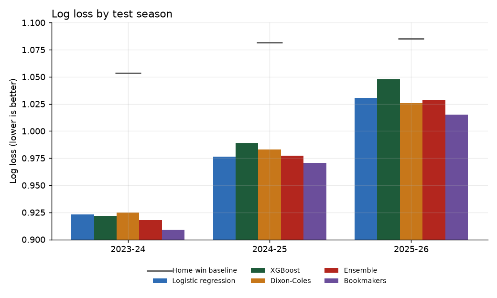
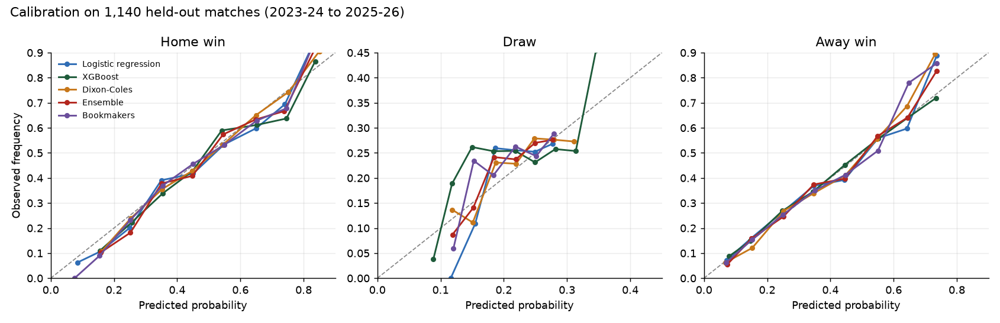
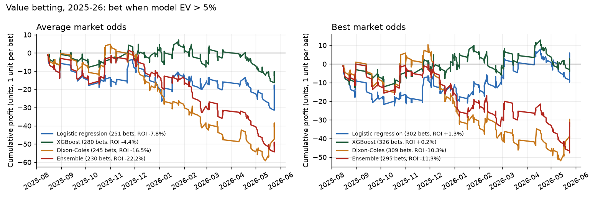

# Premier League match predictor vs the bookmakers

**Question:** can a machine learning model predict Premier League results well enough to beat the probabilities implied by betting odds?

**Short answer:** no, not reliably. The models get most of the way from a naive baseline to the market, but bookmaker odds were still better calibrated in every test season, and a value-betting strategy built on the models did not produce a profit that could be told apart from luck. That's a real finding, and the reasons why are the interesting part.



## Results

Models were trained only on seasons before the one they predict (walk-forward, from 2016-17), then scored on 2023-24, 2024-25 and 2025-26: 1,140 held-out matches.

| Model | Log loss (3 seasons) | Accuracy (3 seasons) | Log loss (2025-26) | Accuracy (2025-26) |
|---|---|---|---|---|
| Always home win | 1.0735 | 43.2% | 1.0851 | 42.6% |
| Logistic regression | 0.9767 | **53.7%** | 1.0304 | 48.2% |
| XGBoost | 0.9855 | 53.3% | 1.0473 | 48.4% |
| Dixon-Coles (Poisson) | 0.9779 | 52.8% | **1.0259** | 46.3% |
| Ensemble (average of the three) | **0.9745** | 52.7% | 1.0287 | 47.4% |
| Bookmakers (average odds, margin removed) | 0.9661 | 54.0% | 1.0185 | 49.0% |

Log loss is the headline metric: it rewards honest probabilities, not just picking the favourite. RPS and Brier scores (in `reports/results.json`) tell the same story.

**The gap to the market is small but real.** A paired bootstrap on the three test seasons puts the ensemble's log loss 0.0084 above the bookmakers (95% interval 0.0000 to 0.0169). Every individual model is significantly worse than the market.

**2025-26 was an unusually hard season to call.** Even the bookmakers' log loss rose from 0.909 in 2023-24 to 1.019, so single-season accuracy figures should be read alongside the three-season numbers.

**Calibration is good.** When the models said 60%, it happened about 60% of the time. All models, like the market, rarely rate a draw above 30%.



### Would it have made money?

Strategy: stake 1 unit on the outcome with the highest expected value (model probability × decimal odds − 1) whenever that value exceeds 5%.

| Model | 2025-26 bets | 2025-26 ROI | 3-season ROI | 3-season 95% interval |
|---|---|---|---|---|
| Logistic regression | 253 | +2.2% | −2.8% | −14.8% to +9.5% |
| XGBoost | 288 | +0.7% | −4.1% | −14.5% to +7.0% |
| Dixon-Coles | 247 | −9.0% | −7.8% | −20.1% to +4.6% |
| Ensemble | 232 | −4.6% | −2.6% | −15.3% to +11.0% |

(Average market odds. Results with the best available odds and at 0% and 10% thresholds are in `reports/results.json`.)



Every interval spans zero. A positive single-season ROI for logistic regression turns negative over three seasons: exactly the pattern you'd expect from noise. The bookmaker's margin (4.1% to 5.5% on average odds in the test seasons) is the hurdle a model has to clear just to break even, and a model that is slightly *less* accurate than the market can't clear it.

One pattern worth flagging, not trusting: across three seasons, the ensemble's draw bets returned +18.7% on 99 bets while its home-win bets lost 11.9%. With this many slices of the data, one of them looking good is expected by chance. It would need to hold up on a fresh season before it meant anything.

## Why the market wins

- **Bookmakers see what the model can't.** Injuries, suspensions, rotation before a cup tie, a new manager, team news an hour before kick-off. The model only sees past results and shots.
- **The market aggregates.** Average odds pool many bookmakers and the sharp bettors who move their lines. Beating that with public data is a high bar.
- **Features are mostly already priced in.** Elo and xG trends are exactly what professional models use.

## What drove the predictions

XGBoost's gain importance and the logistic regression coefficients agree: **Elo rating difference** is the strongest single signal, followed by the **exponentially weighted xG difference**. Raw points-based form adds little once those are included, and its logistic coefficient for a home win is slightly *negative*. That suggests a team collecting more points than its underlying numbers justify tends to come back down: a good illustration of why xG is useful. Rest days and the promoted-team flag barely register.

## Method

### 1. Data (`src/data.py`)
- Results, shots, shots on target, and pre-match odds (market average and best available) from [football-data.co.uk](https://www.football-data.co.uk/englandm.php), 2005-06 to the current season: 8,000 matches.
- Seasons before 2016-17 are warm-up history for the Elo ratings and rolling features. The modelling window is 2016-17 to 2025-26 (3,820 matches).
- Cleaning: unified team names (e.g. two spellings of Nottingham Forest), recomputed results from scores, dropped invalid odds, handled the Covid-extended 2019-20 season (it ended in July 2020, so seasons are cut on 1 August).
- If football-data.co.uk is unreachable, the loader falls back to a GitHub mirror of the same data.

### 2. Features (`src/features.py`)
Every feature uses only matches that finished before kick-off.

| Family | Features |
|---|---|
| Elo | Own implementation: home advantage, goal-difference multiplier, 20% summer regression to the mean, promoted teams start at the average rating of the teams they replaced |
| Rolling form (last 5) | Points, goal difference, xG for and against, shots on target for and against (as home-minus-away differences) |
| Smoothed form | Exponentially weighted goal difference and xG difference (span 10) |
| Venue form | Home side's last 5 home games, away side's last 5 away games |
| Season | Points per game so far this season |
| Schedule | Rest days since the previous league match |
| Promotion | Flag for a team's first season back; missing history filled with the average of past promoted teams, not the league average |

**About xG.** By default the pipeline uses a shot-based xG proxy: a Poisson regression of goals on shots on target and off-target shots, fitted only on 2005-06 to 2013-14 so it can't leak into training or test data. It captures shot volume and accuracy but not shot quality. Real xG from [Understat](https://understat.com) is supported: run `python -m src.xg --fetch` to download it, and the pipeline merges it automatically. That's the most promising improvement to try.

### 3. Models (`src/models.py`)
- **Baseline:** always predict a home win (probabilities = training-set outcome rates).
- **Logistic regression:** multinomial, standardised features; C chosen on a validation season.
- **XGBoost:** shallow trees (depth 2), strong regularisation, tree count chosen by early stopping on a validation season.
- **Dixon-Coles (stretch goal):** attack and defence ratings per team with a home advantage, the Dixon-Coles correction for low scores, exponential time decay (half-life about a year), and a shrinkage prior that treats promoted sides as weaker until they've played. Refitted every week of the test season. It predicts full scorelines, which the app shows as a grid.
- **Ensemble:** equal-weight average of the three.

### 4. Evaluation (`src/evaluate.py`)
- Hyperparameters tuned once on 2022-23 (training 2016-17 to 2021-22), then frozen. The test seasons were never used for tuning.
- Walk-forward testing: each test season is predicted by models trained on every earlier season. No random shuffling.
- Metrics: log loss, accuracy, Brier score, ranked probability score, calibration curves, and paired bootstrap confidence intervals against the bookmakers.
- Bookmaker probabilities: 1/odds, normalised to remove the margin.

### 5. Betting simulation
Flat 1-unit stakes on the single highest-value outcome per match when value exceeds a threshold (0%, 5%, 10%), using average odds and best available odds, with bootstrap intervals on ROI. A fractional-Kelly option is in `simulate_betting`.

## Limitations and next steps
- Real xG from Understat instead of the shot-based proxy.
- Team news (injuries, lineups) is the biggest missing signal and the market's main advantage.
- Rest days only count league matches, so European and cup fixtures are invisible.
- Closing odds would be a tougher and fairer benchmark than the pre-match averages used here.
- Use the model *with* the market: a model that takes the bookmaker probability as a feature and looks for systematic corrections (for example, around draws) is the realistic route to an edge.

## Run it

```bash
pip install -r requirements.txt
python run_pipeline.py        # downloads data, builds features, evaluates, saves models (under a minute)
streamlit run app.py          # pick two teams
```

Optional: `python -m src.xg --fetch` before running the pipeline to use real Understat xG.

## Project structure

```
app.py                  Streamlit app
run_pipeline.py         end-to-end pipeline
src/data.py             download, clean, merge
src/xg.py               xG proxy + Understat fetcher
src/features.py         Elo, rolling form, venue form, rest days
src/models.py           baseline, logistic regression, XGBoost, Dixon-Coles
src/evaluate.py         metrics, calibration, bootstrap, betting simulation
data/                   cleaned matches and features
models/                 trained models used by the app
reports/                results.json, test-set predictions, figures
```

## CV bullet

> Built an end-to-end Premier League prediction system (Elo, rolling xG and form features, logistic regression, XGBoost and a Dixon-Coles Poisson model) on 3,800+ matches; with walk-forward validation over three held-out seasons, models reached 53.7% accuracy against 43.2% for a home-win baseline and 54.0% for bookmaker favourites, and a value-betting backtest showed no statistically significant edge over the market.
